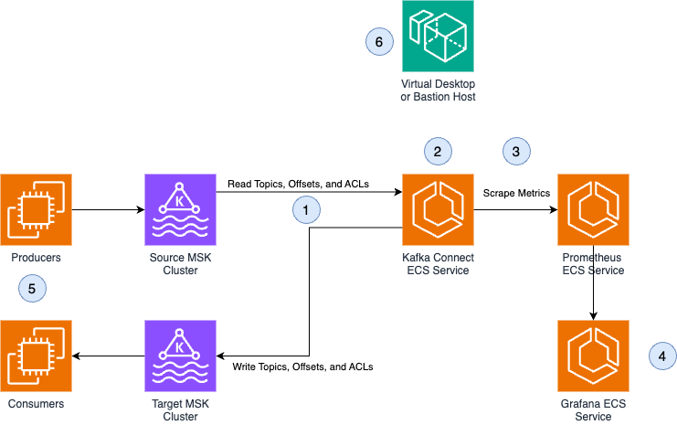

# MSK Migration Resources

This repository accompanies the [Amazon MSK migration lab](https://amazonmsk-labs.workshop.aws/en/migration.html).
It includes resources used in the lab including AWS CloudFormation templates, configuration files and Java code. This repository differs from the lab in deploying MirrorMaker on ECS Fargate for improved resilience, scalability, and maintainability.  

## Overview

For more background on Kafka Connect, please see [kafka-connect](./kafka_connect.md).



1. Kafka Connect reads from configured source cluster,
replicating topics, consumer group offsets, and ACLs 
1-1 to the target cluster

2. ECS services are deployed privately in a multi-AZ configuration,
with autoscaling based on task CPU to automatically scale to
meet Kafka cluster load and ensure fault tolerance when tasks fail 

3. Prometheus is used to scrape metrics from Kafka Connect
tasks to monitor replication latency and task status over time

4. Grafana is used to visualize Prometheus metrics

5. Consumers can be migrated to the target cluster
over time as topics and consumer groups are kept in sync 
by Kafka Connect. Once consumers are migrated to the target 
cluster, producers can migrate as well.

6. Bastion host or virtual desktop are used to access private resources,
such as configuring Kafka Connect tasks and monitoring replica lag
in Grafana

## Containerization for Kafka Connect

This project relies on Docker images running in ECS Fargate to deploy Kafka Connect, Prometheus, and Grafana. 

The [`build_images.sh`](./build_images.sh) script will build and deploy the Kafka Connect and Prometheus images to ECR repositories. It requires that the ECR repositories have already been created, and are named `kafka-connect` and `prometheus`. The Terraform resources will create the ECR repositories on your behalf - please see [automated build instructions](#option-1-automated-infrastructure-build) for more information.

Usage:

`./build_images.sh ACCOUNT_ID REGION`

`./build_images.sh 012345678910 us-east-1`

The build script includes environment variabls to build AMD x86 images, even when running on
ARM hosts. If you choose to build and deploy your images manually without the build script, please
ensure you build AMD x86 images:

`DOCKER_DEFAULT_PLATFORM="linux/amd64" docker build .`

### Kafka Connect Image
The root folder contains the definitions for [CustomMM2ReplicationPolicy](./CustomMM2ReplicationPolicy/) and Centos-based Java dependencies necessary for running Kafka Connect in the [Dockerfile](./Dockerfile), as outlined below. It also  contains the [Kafka Connect configuration examples](./Configuration/connectors/) for MirrorMaker tasks in a variety of scenarios (such as IAM authentication, mTLS authentication, etc.).

### Prometheus Image 
The [prometheus folder](./prometheus/) contains a custom Prometheus image that includes the necessary scrape
targets and intervals to gather Prometheus metrics from the Kafka brokers.

## Deployment

### Infrastructure
First, we need to build the backend infrastructure (ECS tasks, Kafka clusters, etc) for the migration tasks. We can do this either with the automated build scripts, or manually.

#### Option 1: Automated Infrastructure Build
The majority of the required infrastructure for this example can be built and deployed using the Terraform source located in [terraform/](./terraform/README.md). The only thing not provisioned in the Terraform example are the VPC to deploy in, and the build/push of the Docker images. After the Terraform has been deployed, the images can be automatically built using the provided [build script](./build_images.sh) to build and push to ECR.

```
cd terraform/
terraform init
terraform apply -var-file main.tfvars

cd ..
./build_images.sh 012345678910 us-east-1
```

Finally, you will need to deploy the Kafka Connect tasks ([see below](#application-and-monitoring)). 

#### Option 2: Manual Infrastructure Build

Please see [the manual build instructions](./manual_build.md) for steps on deploying infrastructure manually via the AWS CLI.

### Application and Monitoring
Once the infrastructure is deployed and our ECS tasks reach the RUNNING state, we can set up the monitoring and MirrorMaker tasks. To access the ECS tasks, ensure you have an SSH tunnel/proxy running to set up the connectivity, or use a bastion host / Amazon WorkSpaces virtual desktop.

To make a ssh tunnel to your Amazon EC2 bastion and specify the port your proxy is using:

```
ssh -i privatekey.pem ec2-user@ec2-xx-xxx-xxx-xxx.compute-1.amazonaws.com -ND 8157
```

#### Grafana/Prometheus

1. Navigate to [http://prometheus.monitoring:9090](http://prometheus.monitoring:9090) and verify you can view main page. Note that this URL may differ if you used the automated build - the URLs for these services can be found in the terraform outputs.

2. Navigate to [http://graphana.monitoring:3000](http://graphana.monitoring:3000) and verify you can view dashboard

        * The default username and password is `admin`

3. Add a new source: 
    
    1. Select Prometheus as type 
    2. Enter: `http://prometheus.monitoring:9090` as URL 3-Click **Test and Save** button

4. Import the [grafana/MM2-dashboard-1.json](./grafana/MM2-dashboard-1.json) monitoring dashboard

#### Kafka Connect MirrorMaker Tasks

1. If you used the manual build, clone this repository on your instance

    ```
    git clone https://github.com/aws-samples/mirrormaker2-msk-migration.git
    ```

    If you used the automated build, copy the configured task definitions from S3 to your instance - the S3 URIs for these files can be found in the terraform outputs:

    ```
    aws s3 cp s3://my-config-bucket/connector/mm2-msc-iam-auth.json .
    aws s3 cp s3://my-config-bucket/connector/mm2-hbc-iam-auth.json .
    aws s3 cp s3://my-config-bucket/connector/mm2-cpc-iam-auth.json .
    ```

2. Edit the connector json files in [configurations](./Configuration/connectors/) directory with your broker addresses if not already populated.
    
3. Run the source connector, Example for IAM:

    ```
    curl -X PUT -H "Content-Type: application/json" --data @mm2-msc-iam-auth.json http://kafkaconnect.migration:8083/connectors/mm2-msc/config | jq '.'

    ```

4. Check the status of the connector to make sure it's running:

    ```
    curl -s kafkaconnect.migration:8083/connectors/mm2-msc/status | jq .
    ```

5. Repeat steps 3&4 for two other connectors:

    ```
    curl -X PUT -H "Content-Type: application/json" --data @mm2-cpc-iam-auth.json http://kafkaconnect.migration:8083/connectors/mm2-cpc/config | jq '.'

    curl -s kafkaconnect.migration:8083/connectors/mm2-cpc/status | jq .

    curl -X PUT -H "Content-Type: application/json" --data @mm2-hbc-iam-auth.json http://kafkaconnect.migration:8083/connectors/mm2-hbc/config | jq '.'

    curl -s kafkaconnect.migration:8083/connectors/mm2-hbc/status | jq .
    
    ```

If you need help running a sample Kafka producer / Consumer, refer to [MSK Labs Migration Workshop](https://catalog.workshops.aws/msk-labs/en-US/migration/mirrormaker2/usingkafkaconnectgreaterorequal270/customreplautosync/migrationlab1)

## FAQ

### Why not use MSK Connect?
We choose to run Kafka Connect on ECS to deploy MirrorMaker for this use case instead of MSK Connect. There are two main reasons for this:

1. For a migration use case, we want to use a custom replication policy JAR to change how MirrorMaker names topics in the replicated cluster. Due to the JAR naming conventions, MSK Connect will not recognize our custom replication policy, and therefore won't allow our custom topic naming logic.
2. MSK Connect doesn't allow us to monitor detailed Prometheus metrics for the MirrorMaker tasks. Because we value monitoring these metrics, we deploy in ECS where we can scrape Prometheus metrics exposed by Kafka Connect.
